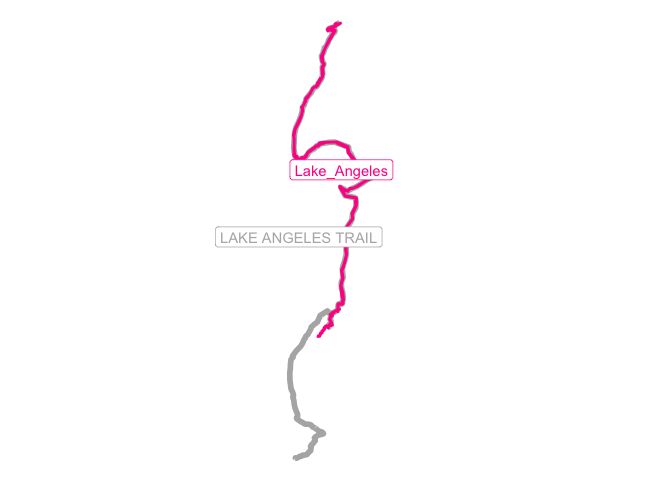

<!-- README.md is generated from README.Rmd. Please edit that file -->

# trailcover

<!-- badges: start -->
<!-- badges: end -->

The goal of trailcover is to allow you to easily compare your tracks
(gpx created by your physical walking, running, hiking, etc.) with
official trails.

## Installation

You can install the development version of trailcover from
[GitHub](https://github.com/) with:

``` r
# install.packages("pak")
pak::pak("monkeywithacupcake/trailcover")
```

## Example

Package comes with example data:

- Olympic National Park trails as geojson
- Lake Angeles hiking track as gpx
- Olympic National Forest trails as kmz

You can use the example data to see how to use the functions and then
use your own

``` r
library(trailcover)

# read in the example track
# showing a hike from Lake Angeles in the Olympic National Park
this_track <- read_geo(trailcover_example("Lake_Angeles.gpx"))
#> building line from gpx layer 'tracks'
```

``` r

# read in the example Olympic National Park trails
ex_onp_trails <- read_geo(trailcover_example("onp.geojson"))
#> Reading layer `ONP' from data source 
#>   `/private/var/folders/2h/k8pm08x94n73r28zjl2xplxh0000gn/T/RtmpFUn1lK/temp_libpath10c4c78e2e03e/trailcover/extdata/onp.geojson' 
#>   using driver `GeoJSON'
#> Simple feature collection with 202 features and 2 fields
#> Geometry type: MULTILINESTRING
#> Dimension:     XY
#> Bounding box:  xmin: -124.733 ymin: 47.50167 xmax: -123.0398 ymax: 48.27514
#> Geodetic CRS:  WGS 84
```

``` r
# just focus on one trail for which we have a track
this_trail <- ex_onp_trails[ex_onp_trails$TRAIL_NAME == 'LAKE ANGELES TRAIL',]

# see the basic overlap map
map_track_v_trail(this_trail, this_track)
#> Warning in st_point_on_surface.sfc(sf::st_zm(x)): st_point_on_surface may not
#> give correct results for longitude/latitude data
#> Warning in st_point_on_surface.sfc(sf::st_zm(x)): st_point_on_surface may not
#> give correct results for longitude/latitude data
```



``` r

# see how much of the trail your track covers (distance)
onp_tracked <- get_coverage(big_sf = ex_onp_trails,
                            little_sf = this_track)
#> Warning: attribute variables are assumed to be spatially constant throughout
#> all geometries
```

``` r

# get a map of the full trail network with your completions
map_coverage(trail_network = ex_onp_trails, covered_sf = onp_tracked)
#> [1] "Total coverage of 0.57% not including any double coverage"
```


``` r

# note that you do not have to do a full trail network
# this example shows the map only showing the two trails with
# coverage
map_coverage(trail_network = ex_onp_trails[ex_onp_trails$TRAIL_NAME %in%
                                             onp_tracked$TRAIL_NAME,],
             covered_sf = onp_tracked)
#> [1] "Total coverage of 31.84% not including any double coverage"
```


``` r

# and this shows just the one trail that we focused on
# note that the returned object is a plot, which can be
# modified
map_coverage(trail_network = this_trail,
             covered_sf = onp_tracked) +
  ggplot2::labs(title = "A new title")
#> [1] "Total coverage of 72.37% not including any double coverage"
```


``` r
# in this last case, you see that the trail is covered 72%
# the color of the track is based on the amount of coverage of that 
# trail and not of the whole system
```
